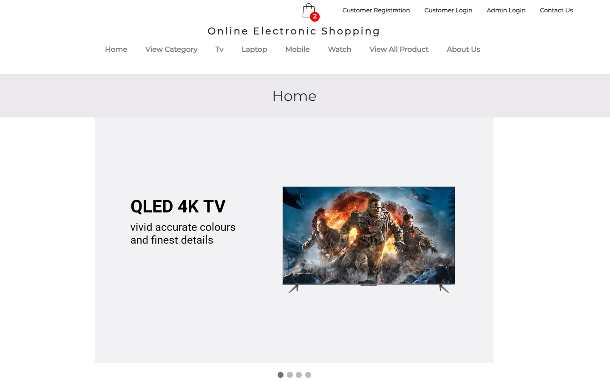
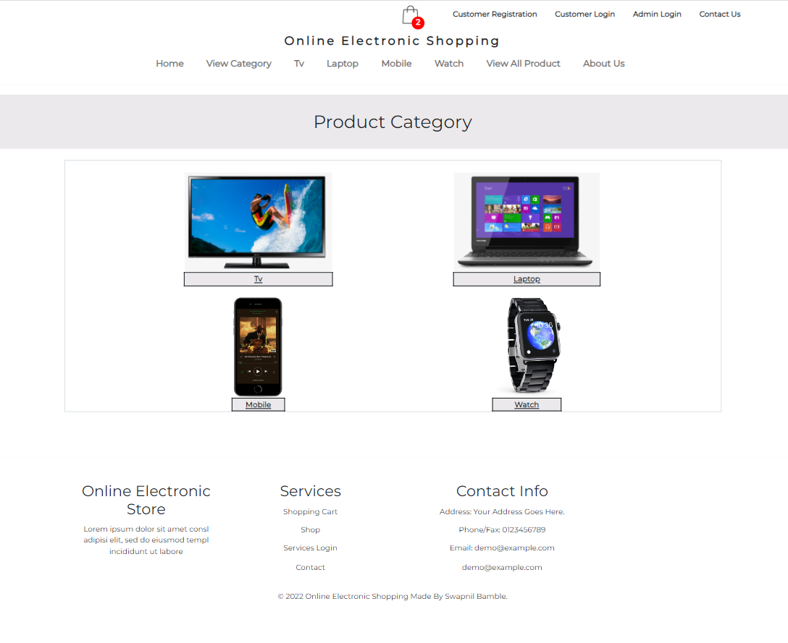
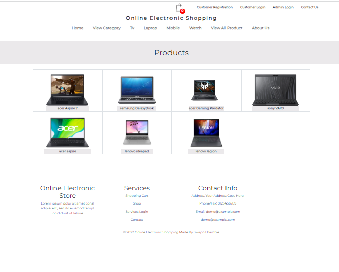
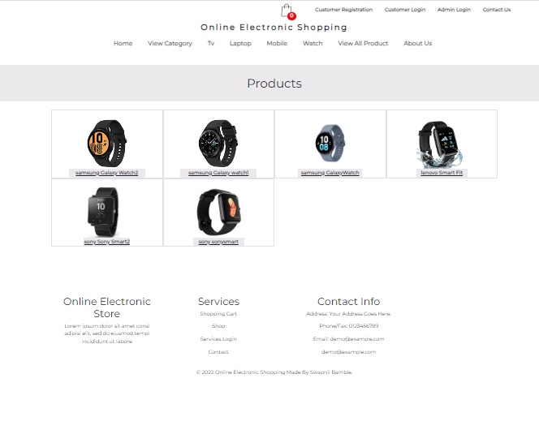
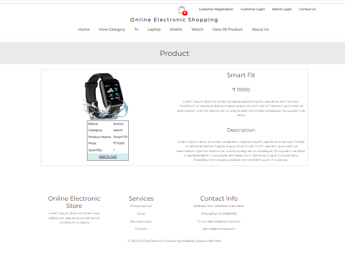
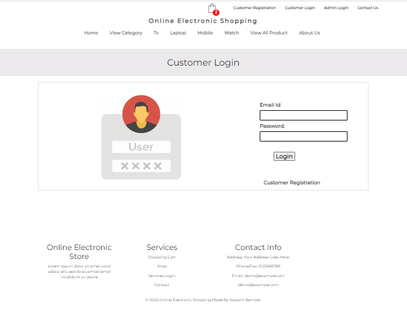
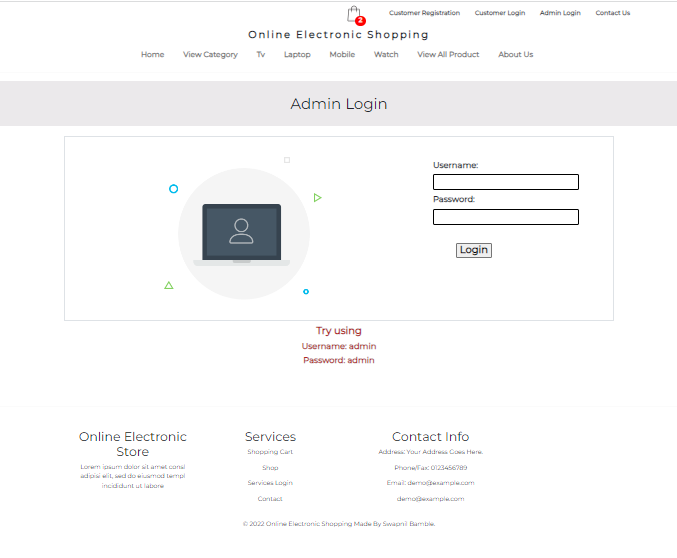

# Ecommerce Application - Java J2EE

### Application Features:
- It shows the working example of how Online Shopping Websites works.
-   Where User can add product to cart, user can register,login,logout or buy product. and Admin can Add new Products to items list and can manage the Customers.

### Technology used in this Project: 
- i) Java: all Backend logic has been written in java.
- ii) HTML,CSS and Bootstrap: designing page layout.
- iii) JSP & Javascript: all the front end logic has been written in jsp and javascript. 
- iv) SQLite: SQLite database has been used as database. 
- v) Tomcat: project will be run over the tomcat server.
- vi) Maven: Maven is used for getting required jar files.

### Software And Tools Required:
- Java JDK 8+
- Eclipse EE
- Apache Maven
- Tomcat v8.0+
- SQLite Tools (Online or Offline Tool)

### Some Screenshots of this Project:

==================================================================================================================================================================

==================================================================================================================================================================

==================================================================================================================================================================

==================================================================================================================================================================

==================================================================================================================================================================

==================================================================================================================================================================

==================================================================================================================================================================

==================================================================================================================================================================

==================================================================================================================================================================

==================================================================================================================================================================

